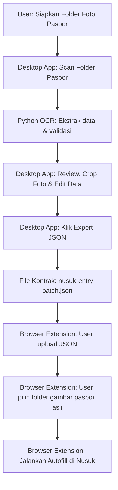

# EntryMate By Ghaniya

EntryMate By Ghaniya adalah sistem otomatisasi entri data paspor untuk platform Nusuk. Proyek ini memisahkan kekhawatiran (*separation of concerns*) antara pemindaian OCR lokal dan otomatisasi browser menggunakan arsitektur berbasis data kontrak JSON.

---

## 📌 Daftar Isi
- [Pendahuluan](#pendahuluan)
- [Arsitektur Sistem](#arsitektur-sistem)
- [Diagram Alur Kerja (Workflow)](#diagram-alur-kerja-workflow)
- [Struktur Direktori](#struktur-direktori)
- [Penjelasan Komponen](#penjelasan-komponen)
  - [1. Python OCR Engine (`python-ocr`)](#1-python-ocr-engine-python-ocr)
  - [2. Tauri Desktop Client (`passport-desktop`)](#2-tauri-desktop-client-passport-desktop)
  - [3. Browser Extension (`chrome-extension`)](#3-browser-extension-chrome-extension)
- [Persyaratan Sistem (Prerequisites)](#persyaratan-sistem-prerequisites)
- [Instalasi & Setup Developer](#instalasi--setup-developer)
- [Perintah Pengembangan & Pengujian](#perintah-pengembangan--pengujian)
- [Panduan Packaging & Rilis Lokal](#panduan-packaging--rilis-lokal)
- [Kebijakan Penyimpanan Data Lokal](#kebijakan-penyimpanan-data-lokal)

---

## 📖 Pendahuluan

Sistem ini dirancang untuk memproses foto paspor secara lokal di komputer pengguna menggunakan OCR, memverifikasi data secara akurat, dan memasukkannya ke formulir pendaftaran jemaah di website Nusuk secara cepat dan otomatis. 

Proyek ini dibangun menggunakan **kontrak data JSON** sebagai satu-satunya jembatan antara aplikasi desktop pemindai dan extension browser otomatisasi. Hal ini menghilangkan kebutuhan komunikasi real-time seperti WebSocket, lokal HTTP API, atau Native Messaging Host tradisional, sehingga meningkatkan keandalan sistem pada koneksi internet yang tidak stabil dan mempermudah deployment.

---

## ⚙️ Arsitektur Sistem

Sistem EntryMate terbagi menjadi 3 subsistem utama:
1. **Python OCR Engine**: Bertanggung jawab mendeteksi gambar paspor, mengekstrak data dari MRZ (Machine Readable Zone) dan area visual, memvalidasi ICAO checksum, serta mentransliterasi nama Latin ke bahasa Arab.
2. **Tauri Desktop Client**: Menyediakan antarmuka grafis (GUI) ramah pengguna untuk mengontrol OCR, melakukan proses pemotongan paspor secara presisi (*cropping*), me-review/mengoreksi data hasil pemindaian, dan mengekspor batch JSON.
3. **Chrome Extension**: Berfungsi menjalankan otomatisasi DOM pada halaman Nusuk. Extension menerima unggahan JSON, meng-cache berkas gambar paspor jemaah secara lokal, dan meng-autofill formulir pendaftaran.

---

## 🔄 Diagram Alur Kerja (Workflow)



---

## 📂 Struktur Direktori

Berikut adalah struktur direktori utama di dalam repositori:

```text
visa-entry-bot/
├── chrome-extension/              # Browser extension untuk otomatisasi Nusuk
│   ├── content/                   # Skrip otomatisasi halaman (autofill, navigasi)
│   ├── icons/                     # Aset ikon extension
│   ├── background.js              # Service worker (menangani debugger upload)
│   ├── content.js                 # Loader konten utama
│   ├── FEATURE_MATRIX.md          # Dokumentasi detail fitur extension
│   ├── panel.html & panel.js      # Panel kontrol otomatisasi samping (iframe/sidebar)
│   └── popup.html & popup.js      # Popup menu popup extension action
├── data/                          # Folder sampel data lokal & data simulasi (tidak dilacak Git)
├── passport-desktop/              # Aplikasi desktop Tauri (Rust + Vanilla JS)
│   ├── src/                       # Antarmuka desktop (HTML, CSS, JS)
│   ├── src-tauri/                 # Backend Rust (Tauri app, process runner, file helper)
│   │   ├── src/lib.rs             # Logika utama command Rust dan executor Python
│   │   └── Cargo.toml             # Konfigurasi dependensi Rust
│   └── README.md                  # Panduan dev & build subsistem desktop
├── python-ocr/                    # Engine OCR berbasis Python
│   ├── services/                  # Modul pemrosesan gambar, OCR, parsing, & validasi
│   │   ├── data/                  # Layout paspor & override transliterasi Arab
│   │   ├── layout_profiles.py     # Loader konfigurasi koordinat visual OCR
│   │   ├── mrz_validation.py      # Validator ICAO TD3 checksum
│   │   └── tesseract_runner.py    # Abstraksi eksekutor Tesseract OCR
│   ├── scripts/                   # Utilitas benchmark, validasi, & perluasan golden data
│   ├── main.py & scan_worker.py   # Entrypoint CLI dan pembungkus Tauri stdout IPC
│   ├── OCR_BASELINE.md            # Laporan performa & akurasi OCR
│   └── PARTIAL_REFACTOR_PLAN.md   # Desain teknis perbaikan pipeline OCR
├── scripts/
│   └── package-local-release.ps1  # Script build otomatis instalasi mandiri Windows
├── package.json                   # Shortcut perintah development terpusat
└── run.cmd                        # Shortcut cepat untuk menjalankan Python OCR
```

---

## 🔍 Penjelasan Komponen

### 1. Python OCR Engine (`python-ocr`)
Engine ini dioptimalkan untuk performa tinggi pada laptop spesifikasi rendah dengan membagi pemindaian menjadi beberapa tahap (*staged execution*):
- **MRZ Fast-Path**: Jika area MRZ beresolusi tinggi dan ICAO checksum valid 100%, visual OCR dilewati untuk menghemat resource.
- **Visual & Panel Fallback**: Jika MRZ buram atau tidak valid, engine akan memindai area visual menggunakan koordinat yang dimuat dari berkas konfigurasi [indonesia_passport_layouts.json](file:///c:/visa-entry-bot/python-ocr/services/data/indonesia_passport_layouts.json).
- **Name & Date Recovery**: Heuristik pembersihan karakter rusak pada nama dan validasi format tanggal ISO.
- **Transliterasi Arab**: Secara otomatis menerjemahkan nama Latin ke Arab secara fonetik menggunakan aturan regex dan kamus override tambahan di [arabic_name_overrides.json](file:///c:/visa-entry-bot/python-ocr/services/data/arabic_name_overrides.json).

### 2. Tauri Desktop Client (`passport-desktop`)
Menggunakan backend Rust untuk menjalankan worker Python secara asinkronus via child process dan mendengarkan stream keluaran standar (stdout) terformat JSON.
- **Tampilan Interaktif**: Memungkinkan pengguna melacak kemajuan scan secara real-time dan melihat laporan error visual.
- **Cropping & Editor Terintegrasi**: Pengguna dapat melakukan pemotongan foto wajah & paspor jemaah secara presisi serta mengoreksi data sebelum diekspor.
- **Export Data**: Menghasilkan `nusuk-entry-batch.json` yang berisi daftar jemaah dengan status `VALID`.

### 3. Browser Extension (`chrome-extension`)
Otomatisasi DOM tingkat lanjut untuk memasukkan data dan berkas foto paspor:
- **Fallback chrome.debugger**: Browser normal tidak mengizinkan extension memasukkan path file lokal langsung ke input file karena keamanan sandbox. Jika upload normal gagal, extension menggunakan protokol Chrome Debugger (`DOM.setFileInputFiles`) sebagai fallback internal.
- **State Management**: Menyimpan state otomatisasi di `chrome.storage.local` dan file paspor di IndexedDB untuk pemulihan otomatis jika halaman tidak sengaja ter-reload.
- **Dukungan Companion**: Mendeteksi secara dinamis jika jemaah memiliki anak-anak/bayi untuk dialihkan melalui alur pendamping (*Companion Form*).

---

## 💻 Persyaratan Sistem (Prerequisites)

Untuk menjalankan proyek ini di lingkungan development Windows, Anda memerlukan toolchain berikut:

1. **Node.js**: Versi `v20.13.x` atau lebih baru.
2. **Rust**: Versi `1.75.x` atau lebih baru (direkomendasikan memakai `rustup`).
3. **Python**: Versi `3.12.x`.
4. **Tesseract OCR**: Harus terpasang di sistem (atau ditaruh di folder Tesseract terbundel pada rilis lokal).
5. **C++ Build Tools**: Visual Studio Build Tools dengan opsi beban kerja `Desktop development with C++` (diperlukan untuk kompilasi Tauri / linker MSVC).

---

## 🛠️ Instalasi & Setup Developer

Ikuti langkah-langkah berikut untuk mengatur lingkungan pengembangan lokal:

### Langkah 1: Kloning & Dependensi Root
```powershell
# Buka workspace root
cd c:\visa-entry-bot
npm install
```

### Langkah 2: Setup Python Virtual Environment
```powershell
# Buka direktori python-ocr
cd python-ocr

# Buat virtual environment
python -m venv .venv

# Aktifkan virtualenv
.\.venv\Scripts\Activate.ps1

# Install dependensi utama dan development
pip install -r requirements.txt
pip install -r requirements-dev.txt
cd ..
```

### Langkah 3: Setup Tauri Desktop Frontend
```powershell
cd passport-desktop
npm install
cd ..
```

---

## 🚀 Perintah Pengembangan & Pengujian

Aplikasi ini menggunakan skrip npm terpusat di root [package.json](file:///c:/visa-entry-bot/package.json) untuk mempermudah eksekusi:

### 🖥️ Menjalankan Aplikasi Desktop (Mode Dev)
```powershell
# Menjalankan aplikasi desktop Tauri dengan hot-reloading frontend
cd passport-desktop
npm run dev
```

### 🧪 Menjalankan Unit Test & Validasi
- **Test Rust (Tauri Backend)**:
  ```powershell
  npm run desktop:test
  ```
- **Cargo Check**:
  ```powershell
  cargo check --manifest-path passport-desktop\src-tauri\Cargo.toml
  ```
- **Test Python OCR**:
  ```powershell
  cd python-ocr
  .\.venv\Scripts\python.exe -m pytest tests\test_scan_session.py tests\test_parser.py tests\test_validator_manifest.py
  cd ..
  ```

### 📊 Menjalankan Benchmark OCR Lokal
Pengembangan algoritma OCR harus divalidasi terhadap dataset emas (*golden dataset*):
```powershell
cd python-ocr
.\.venv\Scripts\python.exe scripts\benchmark_ocr.py ..\data\example-group\passports\trainingData --golden tests\fixtures\ocr_training_golden.json --targets tests\fixtures\ocr_benchmark_targets.json --output .review\ocr-baseline-report.json
```

---

## 📦 Panduan Packaging & Rilis Lokal

Untuk membuat paket siap rilis internal yang dapat dipasang di device target tanpa perlu menginstal Python atau Tesseract manual, jalankan perintah di root direktori:

```powershell
# Jalankan script packaging lokal
npm run package:local
```

### Apa yang dilakukan script ini?
1. Mengompilasi kode Python OCR menjadi executable tunggal mandiri (`scan_worker.exe`) menggunakan **PyInstaller**.
2. Mencari instalasi Tesseract OCR lokal dan membundelnya beserta seluruh berkas data bahasa (`tessdata`).
3. Mengompilasi aplikasi Tauri Rust ke dalam satu file installer Windows (`.exe`) berbasis NSIS yang otomatis membawa resource Tesseract & `scan_worker`.
4. Menyalin kode Chrome Extension ke dalam file ZIP terkompres.
5. Menghasilkan folder rilis di dalam `.local-release/entrymate-by-ghaniya-<versi>-<timestamp>/` yang berisi:
   - Installer Desktop Setup (`entrymate-by-ghaniya-desktop-setup.exe`).
   - Ekstensi browser yang dikompres (`extension/entrymate-by-ghaniya-extension.zip`).
   - Panduan instalasi cepat ([README_LOCAL_RELEASE.md](file:///c:/visa-entry-bot/.local-release/README_LOCAL_RELEASE.md)).

---

## 🔒 Kebijakan Penyimpanan Data Lokal

> [!IMPORTANT]
> **KEAMANAN DATA ADALAH PRIORITAS UTAMA.**
> Proyek ini berurusan dengan data pribadi sensitif (foto paspor & informasi identitas jemaah). Oleh karena itu, aturan ketat berikut harus dipatuhi:
>
> 1. Semua foto paspor asli, dokumen pindaian, log review, serta manifest hasil pemindaian **HANYA boleh disimpan secara lokal** di dalam komputer masing-masing.
> 2. Direktori rilis lokal `.local-release/`, folder data uji jemaah sesungguhnya di luar sampel, serta berkas log sementara tidak boleh diunggah ke repositori Git.
> 3. Pastikan [.gitignore](file:///c:/visa-entry-bot/.gitignore) selalu memblokir berkas biner, berkas data `.json` dinamis jemaah, dan pustaka eksternal.
