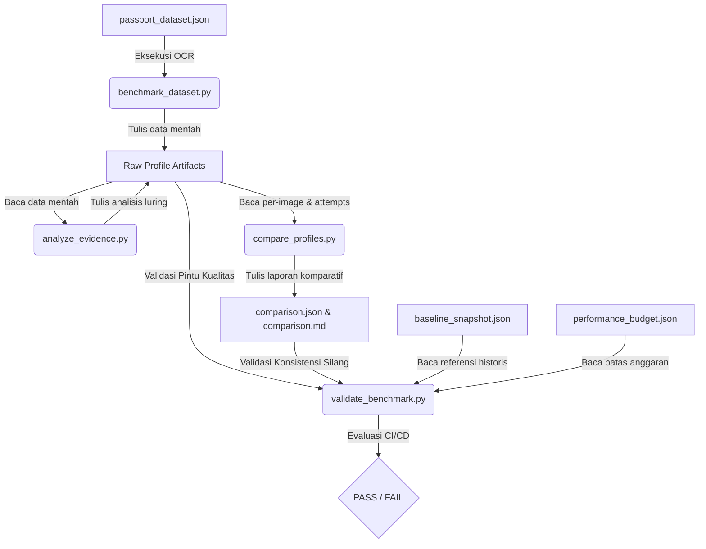

# MRZ Extraction Benchmark & Quality Gate Framework Guide

Panduan ini mendokumentasikan arsitektur, aliran data, serta sistem pintu kualitas otomatis (*quality gate*) pada modul ekstraksi MRZ untuk mendukung pengembangan jangka panjang secara aman dan bebas dari *technical debt*.

---

## 1. Arsitektur Framework Benchmark (Benchmark Architecture)

Ekosistem pengujian kinerja MRZ dirancang menggunakan pola terpisah antara **eksekutor luring** (yang menjalankan OCR) dan **validator data** (yang mengevaluasi kualitas hasil).



---

## 2. Matriks Dependensi Berkas (Artifact Dependency Matrix)

Setiap file hasil benchmark saling terhubung secara silang untuk memastikan keabsahan data (*self-consistency*):

| Berkas Sumber | Berkas Ketergantungan | Aturan Konsistensi Silang |
| :--- | :--- | :--- |
| `summary.json` | `per_image_results.json` | Jumlah total paspor & sukses harus tepat sama. |
| `summary.json` | `ocr_attempts.json` | Akumulasi `ocr_runs` harus sama dengan panjang ocr_attempts. |
| `metadata.json` | `summary.json` | Jumlah dataset `total_images` == `total_passports`. |
| `comparison.json` | `summary.json` (legacy & optimized) | Nilai akurasi & rata-rata runs harus konsisten di comparison. |

---

## 3. Pustaka Bersama (`benchmark_utils.py`)

Seluruh utilitas benchmark bergantung pada modul terpusat [`scripts/benchmark_utils.py`](file:///c:/visa-entry-bot/python-ocr/scripts/benchmark_utils.py) sebagai **Single Source of Truth** untuk:
1. **Load/Save JSON**: Menjamin UTF-8 encoding dan otomatis menyisipkan versi skema ke dictionary.
2. **Path Resolver**: Menentukan lokasi subfolder `legacy/` atau `optimized/` secara dinamis.
3. **Versi Skema (Schema Versioning)**: Menjamin berkas hasil benchmark memiliki format terstandar:
   * `benchmark_version`: `"1.0.0"`
   * `schema_version`: `"1.0"`
   * `generator_version`: `"1.0.0"`

---

## 4. Alur Kerja Pintu Kualitas Otomatis (`validate_benchmark.py`)

Validator digunakan di CI/CD untuk mendeteksi degradasi performa atau akurasi sebelum kode digabungkan ke cabang utama.

### Kategori Validasi & Evaluasi Kesehatan
* **Artifacts (PASS/FAIL)**: Memastikan kelengkapan berkas wajib (`summary.json`, `per_image_results.json`, `ocr_attempts.json`, `metadata.json`, `stage_breakdown.json`, `report.md`).
* **Schema (PASS/FAIL)**: Memastikan field-field wajib terdefinisi pada JSON dan tipe data valid. Toleran terhadap data lama (mengeluarkan WARNING luring tanpa menggagalkan pengujian).
* **Consistency (PASS/FAIL)**: Memverifikasi integritas silang antar berkas (misal jumlah attempts per-paspor).
* **Budget (PASS/FAIL)**: Menguji apakah jumlah RapidOCR runs $\le 320$ dan fallback $\le 20$ kali.
* **Regression (PASS/FAIL)**: Menjamin tidak ada paspor yang lolos pada mode kompatibilitas legacy namun gagal di optimized default.
* **Performance (PASS/WARNING)**: Jika runtime membengkak $> 1.5\times$ dibanding `baseline_snapshot.json` (WARNING dicetak, tetapi pengujian tetap lulus).

---

## 5. Workflow Review & Penggabungan Kode (Merge Review Workflow)

Setiap modifikasi pada area ekstraksi MRZ atau benchmark wajib melalui siklus berikut sebelum merge:

1. **Jalankan Uji Unit**:
   ```bash
   .venv\Scripts\pytest
   ```
2. **Jalankan Benchmark Penuh**:
   ```bash
   python scripts/benchmark_dataset.py --profile optimized --no-resume
   python scripts/benchmark_dataset.py --profile legacy --no-resume
   ```
3. **Jalankan Pintu Kualitas**:
   ```bash
   python scripts/validate_benchmark.py
   ```
4. **Perbarui Baseline**:
   * Jika Anda sengaja mengoptimasi runtime lebih cepat, perbarui nilai absolut di `baseline_snapshot.json` secara manual agar menjadi patokan baru pengujian berikutnya.
